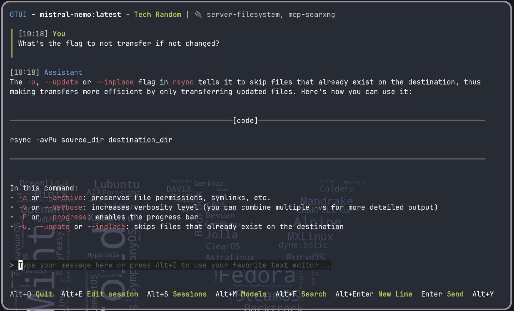
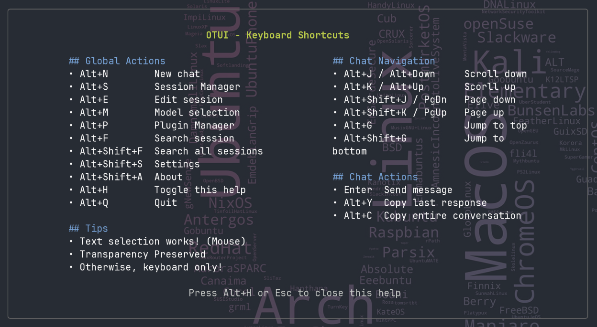

# OTUI - A Minimalist Agentic TUI
maintained by: @hkdb



An opinionated, "speed" and "usability" focused agentic TUI with a built-in MCP registry/plugin system.

## 🚀 Features

- 🏗️ **Effortless Setup** - Single command install & 3 configs in a welcome screen on first launch
- 💫 **Minimalist UI** - Clean, distraction-free interface
- 🚀 **Performance** - Designed to be blazingly fast and responsive
- 👻 **Terminal transparency** - Respects your terminal's transparency settings
- ⌨️ **Keyboard-driven** - Everything is keyboard only except to copy via text selection
- 🖱  **Native text selection** - Highlight and copy any part of the LLM response
- ✏️ **Text Editor Integration** - Toggle your favorite text editor to compose your more complex prompts
- 🚰 **Streaming responses** - Real-time AI responses with typewriter effect
- ⚓ **Markdown Rendering** - Custom performance focused, minimalistic mark-down rendering
- 📦 **Multiple models** - Effortlessly switch between models
- 🎬 **Multiple Sessions** - Use different sessions to encapsulate different context and tasks
- 🗃  **Session history** - Conversations are automatically saved and ready to continue where you left off
- 🔍 **Session search** - Search and find past conversations easily
- 🛣️ **Session import/export** - Easily bring sessions to another machine or share context with others
- ✍🏼   **System Prompts** - Configure system prompts profile-wide or per session
- 🧳 **Portable** - Migrate everything to a new system or switch between user profiles easily
- 🖧  **Profile Sync** - Sync profiles and sessions between devices with any file sync provider
- 💻 **Cross Platform** - Runs on Linux, FreeBSD, Mac, and Windows
- 🔧 **MCP Plugins** - Automatic & Guided download + installations of MCP Plugins
- 🛸 **MCP Registry** - A growing list of MCP server plugins to explore


## 🖥️ OS Support

- GNU/Linux
- FreeBSD
- MacOS
- Windows WSL
- Windows Native (NOT TESTED)

## 📦 Installation

Paste the following into your terminal:

```
curl -sL https://hkdb.github.io/otui/get.sh | bash
```
That's it! Now you just launch OTUI in the terminal by just typing:

```
otui
```

## 🏗️ Basic Concepts

OTUI was designed to be hopefully intuitive enough to any user that is already familiar with keyboard driven environments. At the footer of each screen, there will always be reminders of what the keybindings are. The hope is that, aside from reading this README section, you wouldn't HAVE TO read or touch a user guide at all and still be able to pick it up in no time. If the footer reminders are not enough, there's always a cheat sheet `help` screen.

#### ⌨️ Keyboard Shortcuts

At any point in time, users can press Alt+H to bring up the `help` screen to see what keybindings are set:




In the future, I will likely add the ability to at least customize modifiers if not all keybindings if there's enough interest since some of these key combinations might clash with tiling wm environments.

#### 🗺️ UI Components:

OTUI is made up of the following main UI components:

- `Main Chat Screen` = Where users will chat with LLMs. (As shown at the top of this README)
- `Session Manager`  = Where users can manage sessions (Create, Edit, Search, Import, Export)
- `Model Selector`   = Where users can select the LLM Model to use in the currently loaded session 
- `Plugin Manager`  = Where users can manage MCP plugins (See the next section)
- `Settings`         = Where users can set Data Directory, Ollama Host, Default Model, Profile Wide System Prompt, and Enable/Disable Plugins System
- `Help`             = Where users can see a cheat sheet of all the keybindings
- `About`            = Where users can see information about OTUI and check the release version

#### ✏️ Text Editor Integration

No matter how much work you put into a message input field, nothing beats your favorite text editor when composing complex prompts. That's why OTUI's message input field is integrated with your favorite text editor. At any point in time even if you are in the middle of typing a message, you can just pres `Alt+I` to bring up your favorite text editor temporarily take over the screen to finish composing your prompt. When you quit and save, it will automatically insert the text into your message input field awaiting you to hit `Enter` to send.

OTUI is pretty good at detecting your default text editor but if you have a specific that you want to use for OTUI, just set the environment variable:

```
export OTUI_EDITOR=[ your favorite text editor ]
```

#### ⚙️ Configuration

Default Configuration Locations:

- Configuration directory: `~/.config/otui/`
- Default data directory: `~/.local/share/otui`

Pretty much everything is put inside the data directory. The only thing `~/.config/otui/settings.toml` does is it lets OTUI know where the data dir is. You can think of the data dir like an independent user profile with all your configs and sessions stored in it. If you wanted multiple profiles, all you have to do is go to settings and switch your data directory. OTUI will then automatically load your new profile with all the configs and sessions of that profile without having to restart the app.

The single data directory architecture makes OTUI super portable and syncable. Users can:
- Export the directory into a tar.gz archive directly from within OTUI
- Copy or move the entire directory to another machine and everything is ready to go
- Specify the data directory to be stored in a location that's being synced by Syncthing, Google Drive, etc

A likely future feature is to be able to encrypt your data dir for better security and privacy especially when using major cloud providers to sync.

OTUI falls back on environment variables for configuration so that one can just set env var without using the TUI to setup:

```bash
# Set your Ollama server URL (ex: http://localhost:11434)
export OTUI_OLLAMA_HOST=http://your-ollama-server:11434

# Set your preferred model (ex: llama3.2:latest)
export OTUI_OLLAMA_MODEL=qwen2.5:latest

# Set your prefered data dir location (ex: ~/.local/share/otui)
export OTUI_DATA_DIR=https://your-searxng-instance.com

# Run OTUI
./otui
```
This can be useful if you wanted to run OTUI in a OCI container by just setting the environment varibles on launch.

#### 🤖 MCP Plugins Registry and Plugins System

OTUI comes with a built-in plugins system that enables easy installation of MCP servers as plugins. This plugins system is disabled by default. To enable it, go to the `Settings` screen to enable it. After that, you can press `Alt+P` from anywhere to bring up the `Plugin Manager`.  The `Plugin Manager` will have no plugins by default. Press Alt+R to automatically fetch the Plugins directory from [OTUI MCP Registry](https://github.com/hkdb/otui-registry). User will then see within seconds 4 fully populated plugins lists:

- Curated: Plugins we have at least tried once and known to be working relatively well
- Official: Plugins from [modelcontextprotocol/servers](https://github.com/modelcontextprotocol/servers)
- Automatic: Plugins that can be installed by `Plugin Manager` directly 
- Manual: Plugins that user has to do some manual installation steps to enable

Users can also add their own MCP servers into `Plugin Manager` in the custom tab.

#### 🔐 MCP Plugins Controls

There are 3 layers of controls to ensure a user truly wanted an MCP server to be used in any specific session. MCPs are very powerful but can be damaging if not handled carefully so we wanted to have the proper controls in place to ensure when a MCP server is used, it was absolutely intentional.

Controls Hierarchy:

```
OTUI
  |___ (Enable/Disable) Settings
          |___ (Enable/Disable) Plugin Manager
                 |___ (Enable/Disable) Per Session
```

Each plugin needs to be enabled by the user manually after installation. After a plugin is enabled in the `Plugin Manager`, it will appear in the list of the `Edit Session` screen which the user can get to by either pressing `Alt+E` from the main chat screen or by pressing `e` from `Sessions Manager` while the session is highlighted. The user can then enable the plugin from any session they want.

#### 🥽 MCP Safety

Curated just means we have tried installing and using them ourselves. All other MCP plugins may not have ever been tested by us before. The entry barrier to land in our registry is not high (ie. how popular they are on github, etc). So do your own research and use your own judgement when exploring MCP plugins. We are not responsible for what the MCP plugins do regardless if the cause is related to OTUI's code base or not. 

For more information about the Registry, see [OTUI MCP Registry](https://github.com/hkdb/otui)

## 👾 OTUI in Action


## 🛠️ Building From Source

Requires Go 1.22 or later.

```bash
go mod tidy
go build
```

## 🐛 Debug

Set the below environment variable to enable OTUI debug logging (`[path to data dir]`/debug.log)

```bash
export OTUI_DEBUG=1
```

## ☠️ Uninstall

```bash
rm -rf ~/.config/otui
rm -rf ~/.cache/otui
rm -rf ~/.local/share/otui # or whatever data dir the user specified. This also deletes the sessions.
```

## ⏳ Status

**Completed**:
- ✅ Ollama Only Core Functionality

**Work in Progress**:
- 🚧 Bug Fixes (On-Going)
- 🚧 Provider Abastraction
- 🚧 More Sophisticated session/context management

**Future Features**:
- 🪶 Data folder values encryption
- 🪶 Keybindings modifier customization

## 🎬 Credits

- A lot of OTUI was made possible with: [Bubble Tea](https://github.com/charmbracelet/bubbletea)
- Some of OTUI was originally inspired by: [LIT TUI](https://github.com/Positronic-AI/lit-tui)
- Most of the project was vibe coded with [OpenCode](https://opencode.ai) + [Claude Sonnet 4.5](https://www.anthropic.com/claude/sonnet)

## 📢 Disclaimer

This software is provided as is with no warranty. The author and contributors of this project is not responsible for any damages that this software may directly or indirectly cause.

This project is not associated or affiliated with [OLLAMA](https://ollama.com).

## 🏛️ License

Apache-2
